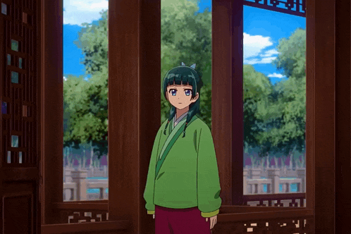

  

---

### About Mario
- When chuck committed to Master, the branch pulled off his master-title and gave it to chuck.
- When Mario declares arrays, they are all of infinite size, because Mario knows no bounds.
- Mario programs do not accept input.

---

### German Wisdom
> Es ist ein Brauch von alters her: Die Dicken sind besonders schwer.

---

  
  

