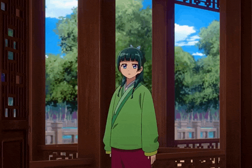

  

---

### About Mario
- Parent is the child of Mario.
- Mario does not need to know about class factory pattern. He can instantiate interfaces.
- Windows 7 was Mario's idea.

---

### German Wisdom
> Jedem Analphabeten sein Diktiergerät!

---

  
  

